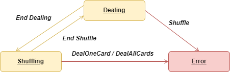

# Deck of Cards Problem Statement - v1.0.0

## Problem Description

Your assignment is to code a set of classes that represent a deck of poker-style playing cards. (Fifty-two playing cards in four suits: hearts, spades, clubs, diamonds, with face values of Ace, 2-10, Jack, Queen, and King.)
Within one of your classes, you must provide two ​operations:
1. shuffle() Shuffle returns no value, but results in the cards in the deck being randomly permuted. Please do not use library-provided “shuffle” operations to implement this function. You may use library provided random number generators in your solution if needed.
2. dealOneCard() This function should return one card from the deck to the caller. Specifically, a call to shuffle followed by 52 calls to dealOneCard() should result in the caller being provided all 52 cards of the deck in a random order. If the caller then makes a 53rd call dealOneCard(), no card is dealt.
Many details of this assignment have been left intentionally vague.
Follow the principle of least surprise in making reasonable decisions regarding the implementation. While this is a trivial assignment, pretend that this code will become a foundational part of a new Appian product.​Take whatever measures you feel are required for your code to meet this bar. We are not concerned with how quickly you complete this assignment.

## Problem Solution

### General Design Remarks 

- This project has been made using pure java to have greater integration and compatibility with others.
    - No 3rd party libraries have been used, such as spring, lombok, etc.
    - Library-provided “shuffle” has not been used.

- We have tried to be as simple as possible.

- Other implementations of "Dealer" can be done using the project's base classes.

- The Deck of Cards is intentionally not visible while the dealer is handling it.

- You cannot manually modify the deck of cards outside of the dealer's reach..

- The Deal of Card problem is implemented considering a possible concurrency scenario without locks. 

### Software requirements

- **Maven:** version 3 ^
- **Java:** version 8 ^
- **JUnit:** version 5 ^

### Building project

To build this project and install the artifact in your maven local respository, you can use:

```shell
$ mvn clean install
```
**Note**: After build, you can find in './target/' folder:
- static/io: Jacoco coverage reports results.
- surefire-reports: Test reports results.

To generate all javadocs project, you can use:

```shell
$ mvn javadoc:jar
```

**Note**: The javadocs are generated in './target/apidocs'

#### The Dealer class

The dealer is the main class in this project and represents the entity who handle the deck of cards.

You can implement as many dealers as you want, they just have to extend from the Dealer class and implement the following methods:

- **doShuffle**: swap random cards within the deck.

- **doDealOneCard**: extract one card from deck.

#### How Dealer class works

The Dealer is a status machine as you see in the following diagram.



This class implements the transitions between actions and must be inherited to implement its abstract methods. By default it has four Dealer implementations although you can implement your own if you wish:

- **DealerImpl** (by default and optimal)
- **DealerArrayShufflempl** 
- **DealerProvidedLiblmpl**
- **DealerListShufflempl** (implemented for comparisons only, uses Collections.shuffle which is prohibited by the problem definition)

### Why use DealerImpl?

We have used the Junits to do some minimal performance tests and the results are as follows:

Shuffle algorithm:

```
--< DealerImpl: Check_shuffle_performance >--
**0.0285ms**
--< DealerListShuffleImpl: Check_shuffle_performance >--
0.0465ms
--< DealerProvidedLiblmpl: Check_shuffle_performance >--
0.0155ms
--< DealerArrayShuffleImpl: Check_shuffle_performance >--
0.0735ms
```


dealOneCard algorithm:

```
--< DealerImpl: Check_deal_all_cards_performance >--
**0.012ms**
--< DealerListShuffleImpl: Check_deal_all_cards_performance >--
0.014ms
--< DealerProvidedLiblmpl: Check_deal_all_cards_performance >--
0.004ms
--< DealerArrayShuffleImpl: Check_deal_all_cards_performance >--
0.0035ms
```

DealerImpl has the best time after DealerProvidedLiblmpl (forbiden by the problem description).

### How use in you project

Once the artifact is built and installed (in your maven local repo), you can use it in your project by adding it as a dependency in your pom.xml.

```xml
<dependency>
	<groupId>com.appian</groupId>
	<artifactId>DeckOfCards</artifactId>
	<version>1.0.0-SNAPSHOT</version>
</dependency>

```

If you are using spring, you could create a ConfigurationBean to create Dealer, as follows: 

```java
import com.appian.service.Dealer;
import com.appian.service.impl.DealerImpl;

@Configuration
public class DummyConfiguration {
	
	@Bean
	public Dealer dealer() {
		return new DealerImpl();
	}
}

```


